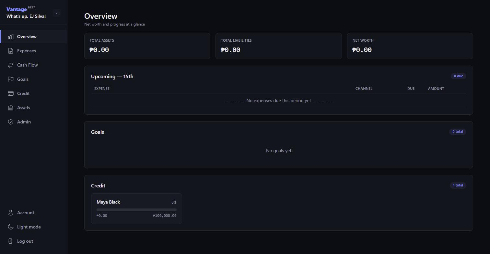
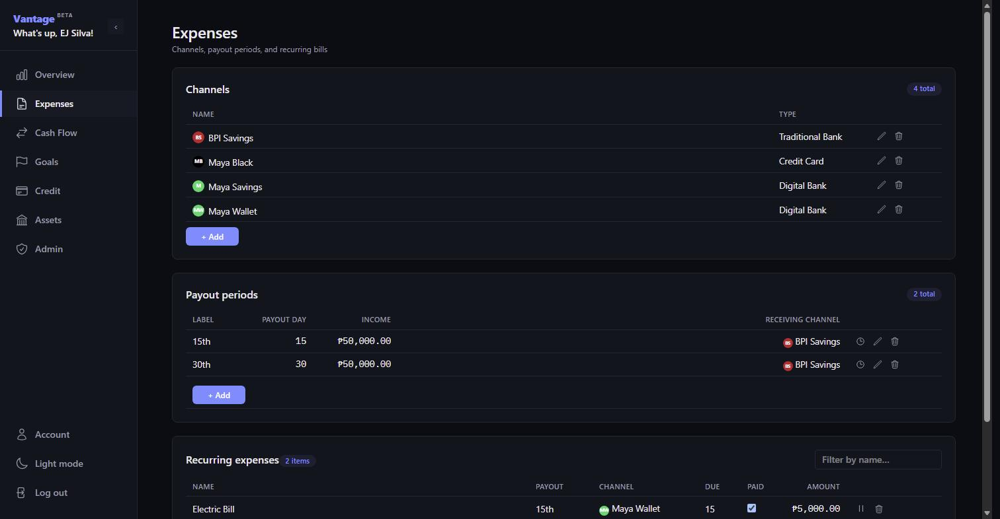

# Vantage <sup>beta</sup>

A personal "ledger" budgeting tool — model how income actually moves through your real accounts, not just where it ends up.

Most budgeting apps show you one running balance. Vantage models the workflow separately: income arrives on a recurring **payout period**, lands in one **channel** (a bank account, e-wallet, or credit card), gets routed onward via explicit **transfers**, and pays **expenses** along the way. Every payout period gets its own computed balance per channel — because your channels and routing are yours to define, there's no fixed diagram to fit into.

## Screenshots





## What's inside

- **Channels** — the accounts money actually moves through
- **Payout periods** — recurring pay dates, each with its own income amount and receiving channel
- **Transfers** — explicit, per-period moves of money from one channel to another
- **Expenses** — recurring bills tied to a payout period and a channel, with due-day tracking and a paid/unpaid toggle
- **Goals, Credit, Assets** — savings targets funded incrementally per payout period, credit line utilization, and a simple asset list feeding an overall net-worth figure on Overview

Sign-in is Google/GitHub OAuth only — no passwords. Multi-tenant: every user's data is fully isolated from every other user's.

## Status

Pre-1.0 (`0.2.0-beta`). Actively developed; expect schema and UI changes between releases.

## Quickstart

```
docker compose up --build
```

In a second terminal, run Compose's file-sync watcher so edits to `app/`/`alembic/` actually reach the containers:

```
docker compose watch
```

Both are needed for local dev on Windows/Mac. This installs dependencies, builds the CSS, runs migrations, and seeds sample data into an empty database. The app is served at [http://localhost:8000](http://localhost:8000).

You'll need OAuth app credentials (Google and/or GitHub) for login to work locally — see `.env.example`.

## Stack

FastAPI rendering server-side HTML via Jinja2, progressively enhanced with HTMX — no client-side JS framework, no JSON API. PostgreSQL via SQLAlchemy 2.0, Alembic for migrations. Tailwind CSS (standalone CLI, no Node/npm). Poetry for dependency management. Docker Compose for local dev, Vercel for deployment.

## Contributing

[`CLAUDE.md`](CLAUDE.md) is the full reference — architecture, every command (lint/type-check/test), branching and CI/deployment conventions, and the reasoning behind the less obvious parts of the codebase. Start there for anything beyond running the app locally.
